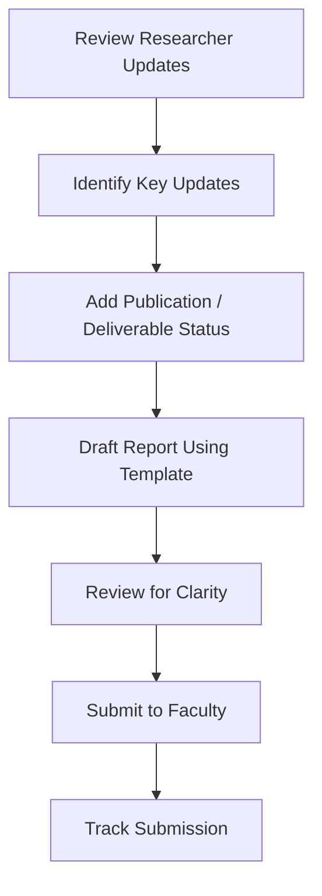

# HAAG Faculty Relations Initiative: Weekly Faculty Report Procedure

*This version reflects a refined, narrowly scoped procedure focused specifically on a step-by-step weekly faculty report process based on instructor feedback.*

**Author:** Erwin Estevez  
**Initiative Area:** Faculty Relations / Communication  

---

## Problem Statement

Faculty visibility into project progress across HAAG teams is inconsistent. Some teams provide updates informally, but there is no standard weekly reporting procedure that ensures faculty consistently receive clear information on project status, progress, blockers, and publication or deliverable progress.

This can make it harder for faculty to stay aligned with the work being done and to identify issues early enough to provide guidance.

---

## Initiative Goal

Create a **very narrow, repeatable, step-by-step procedure** for how the **Computational Advisor** prepares and submits a weekly project report to faculty.

The goal is to improve:

- Consistency of faculty updates  
- Clarity of project status communication  
- Visibility into blockers and deliverables  
- Faculty awareness of research progress over time  

---

## Scope

This procedure focuses only on one recurring task:

> **The Computational Advisor submits a weekly report to faculty.**

It does not cover broader onboarding, escalation systems, or general communication policy.

---

## Weekly Faculty Report Procedure

### Step 1: Review Researcher Progress Inputs
At the end of each week, the Computational Advisor reviews researcher updates, notes, or meeting discussions.

Focus on:
- Work completed  
- Current work in progress  
- Blockers  
- Changes in direction  

---

### Step 2: Identify Key Weekly Updates
Select the most important updates for faculty visibility:

- Major progress  
- Technical or research developments  
- Blockers impacting progress  
- Decisions or input needed  

---

### Step 3: Record Publication / Deliverable Status
Include relevant deliverable progress:

- Paper status (idea, draft, submission, etc.)  
- Experiment progress  
- Dataset readiness  
- Milestones  

---

### Step 4: Draft the Weekly Report
Create a concise, structured report using the standard template (below).

---

### Step 5: Review for Clarity
Ensure the report is:
- Clear and concise  
- Focused on important updates  
- Appropriate for faculty review  

Manager may assist if needed, but the Computational Advisor owns the report.

---

### Step 6: Submit to Faculty
Send the report once per week via:
- Slack (preferred), or  
- Email  

Maintain a consistent cadence.

---

### Step 7: Track Submission
Record submission in a simple tracker:

| Week | Report Sent (Y/N) | On Time (Y/N) | Notes |
|------|------------------|--------------|-------|

---

## Weekly Report Template

The following template should be used for each weekly submission:

---

### **Weekly Project Report – [Project Name]**
**Week:** [Insert Week / Date Range]  
**Prepared by:** [Computational Advisor Name]

---

#### **1. Project Status**
- Brief overall status (on track / at risk / delayed)

---

#### **2. Progress This Week**
- [Key accomplishment 1]  
- [Key accomplishment 2]  
- [Key accomplishment 3]  

---

#### **3. Current Goals / Next Steps**
- [Next step 1]  
- [Next step 2]  

---

#### **4. Blockers / Risks**
- [Blocker 1]  
- [Blocker 2]  

---

#### **5. Publication / Deliverable Status**
- Paper: [idea / draft / submission / revision]  
- Experiments: [status]  
- Dataset: [status]  
- Milestones: [status]  

---

## Metrics for Evaluation (KPIs)

- % of weekly reports sent  
- % of reports sent on time  
- Faculty feedback on clarity  
- Reduction in unclear project status  
- Consistency of deliverable tracking  

---

## Pilot Implementation

This procedure will be piloted within active HAAG teams during the semester to evaluate improvements in communication consistency and faculty visibility.

---

## Expected Outcomes

- More consistent faculty awareness  
- Clearer communication of progress  
- Better visibility into blockers and deliverables  
- A repeatable reporting process  

---

## Intended Audience

- Computational Advisors  
- Faculty Advisors  
- Managers / PMs  

---

## Weekly Report Flow

