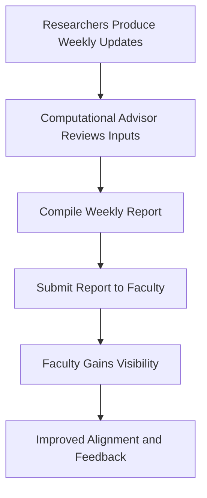

# Part I - Initiative Report

## Weekly Faculty Reporting (Computational Advisor → Faculty)

---

## Describe your initiative / procedure

My initiative is a **standardized weekly reporting procedure from the Computational Advisor to faculty**.

Currently, communication between project teams and faculty varies across HAAG. Some teams provide updates regularly, while others are more inconsistent. There is no clearly defined expectation for what information should be shared weekly, how it should be structured, or who is responsible for delivering it. This can lead to gaps in visibility, unclear project status, and delayed identification of blockers or risks.

To address this, the initiative proposes a **simple, repeatable weekly report** that is prepared and submitted by the Computational Advisor. The report is intended to provide a concise and consistent summary of:

- Project status  
- Weekly progress  
- Current goals / next steps  
- Blockers or risks  
- Publication or deliverable status  

The procedure focuses on making this communication lightweight, structured, and easy to maintain. Rather than introducing a complex system, the goal is to define a clear weekly rhythm that improves visibility without adding unnecessary overhead.

At this stage, the initiative is in an **early design and pilot-planning phase**, not a fully implemented system.

---

## Explain the hypotheses / KPIs you have measured at this time and what is left to be measured

The main hypothesis behind this initiative is:

If a standardized weekly reporting process is introduced, then faculty will have clearer and more consistent visibility into project progress, and communication gaps across teams will be reduced.

A second related hypothesis is:

If progress, blockers, and deliverables are consistently reported, then issues will be identified earlier and alignment between faculty and project teams will improve.

### KPIs identified so far

- Consistency of weekly report submission  
- Clarity of project status communication  
- Visibility of blockers and risks  
- Tracking of publication or deliverable progress  

### What has been measured so far

At this stage, I have primarily identified KPIs rather than fully measured outcomes. Observations across teams suggest that reporting is currently inconsistent and varies in quality and completeness.

### What is left to be measured

- Whether weekly reports are consistently produced across teams  
- Timeliness of report submission  
- Faculty feedback on clarity and usefulness  
- Reduction in unclear or missing project updates  
- Improvement in visibility of deliverables and blockers  

---

## Explain your method for testing these hypotheses via flowcharts

The testing approach is based on introducing a simple weekly reporting cycle and observing consistency and clarity over time.

### Narrative testing method

- Researchers generate weekly updates  
- Computational Advisor reviews and consolidates inputs  
- A structured weekly report is created  
- The report is submitted to faculty  
- Faculty uses the report for visibility and alignment  
- Feedback and consistency are observed over time  

### Simple flow

---

## Explain how stakeholders are engaging with your initiative

The stakeholders for this initiative include Computational Advisors, faculty advisors, managers, and researchers.

Currently, engagement is indirect. Teams are already sharing updates in various forms (Slack messages, meetings, reports), but there is no standardized structure. This means that while communication exists, it is inconsistent and varies significantly across teams.

This partially aligns with expectations. The initiative is designed to build on existing behaviors rather than replace them. However, the lack of consistency suggests that adoption of a standardized format may require reinforcement and clear expectations.

Going forward, the initiative should focus on keeping the process simple and aligned with current workflows to encourage adoption.

---

## What processes have you documented or begun documenting to ensure sustainability?

So far, I have begun documenting:

- The problem statement  
- The purpose of a weekly faculty report  
- The structure and key components of the report  
- The role of the Computational Advisor as the report owner  

The procedure is hosted in a GitHub markdown file for accessibility and reuse.

### Additional documentation planned

- A reusable weekly report template  
- Example completed reports  
- A simple tracking mechanism for report submission  
- Clarification of expectations for consistency and cadence  

---

## How are you currently measuring progress toward your goals?

At this stage, progress is being measured through **design maturity and readiness for pilot testing**, rather than final outcome data.

Current indicators of progress include:

- Clear definition of the problem  
- Narrowing the scope to a specific, repeatable task  
- Identification of relevant KPIs  
- Development of a structured reporting approach  

Future success indicators will include:

- Consistent weekly reporting across teams  
- Improved clarity of project status  
- Positive faculty feedback  
- Reduced variability in communication quality  

---

## What obstacles or bottlenecks have you encountered?

One major bottleneck has been scope. Initial ideas around faculty engagement were broader and more complex, but they were not realistic to implement or test within a limited timeframe. Narrowing the initiative to a single, repeatable reporting task made it more manageable and aligned with instructor feedback.

### Anticipated challenges that have materialized

- Inconsistent researcher updates feeding into reports  
- Variability in how teams define and communicate progress  
- Difficulty maintaining a consistent weekly cadence  

### Unexpected issues

- Balancing conciseness with completeness in reporting  
- Differences in interpretation of what should be included in the report  

These challenges suggest that keeping the process simple and clearly defined will be critical for adoption and long-term sustainability.
